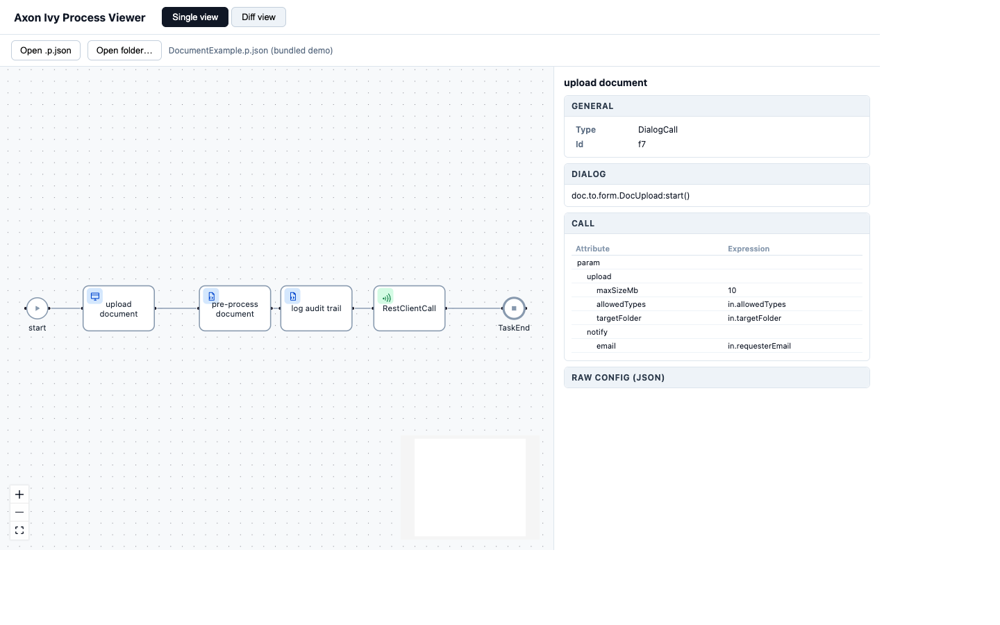
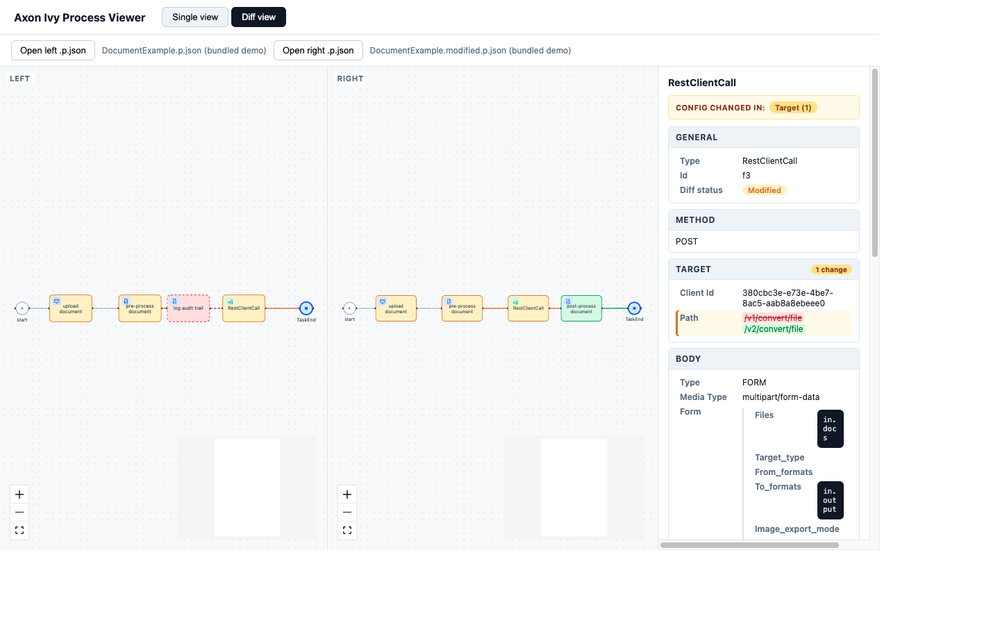
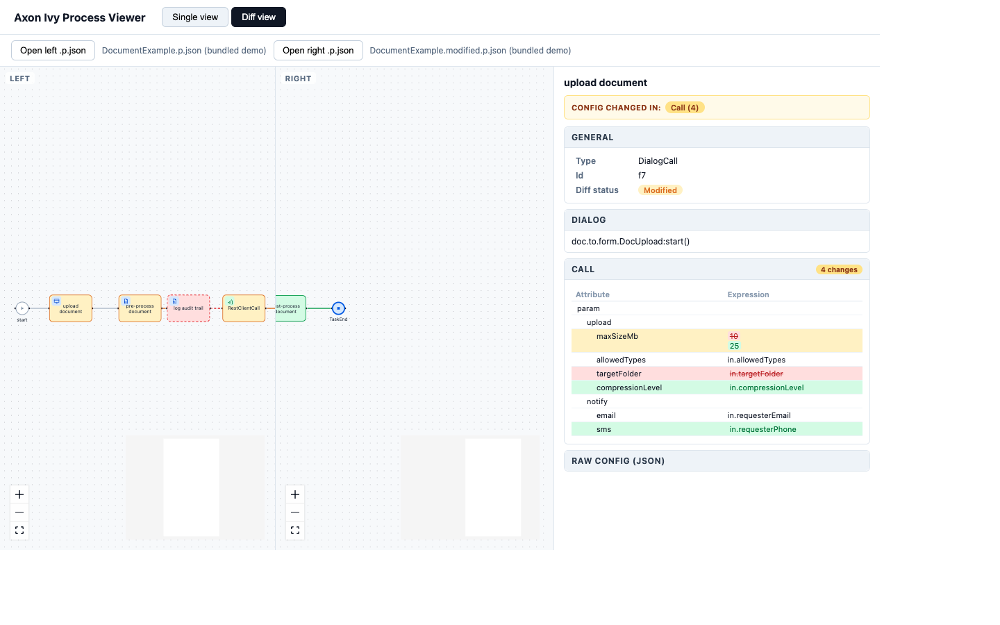
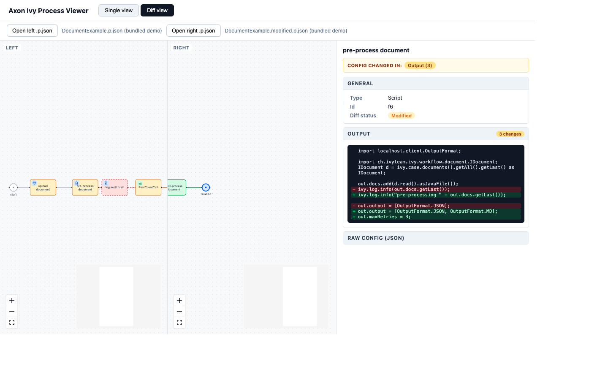

# Axon Ivy Process Merge Editor

A browser-based viewer and diff tool for Axon Ivy `.p.json` process files. It renders the process diagram (elements, connectors, lanes) the way Designer would, lets you inspect every element's configuration, and diffs processes so you can review what a merge, refactor, or colleague's change actually did — without opening Designer.

It offers three modes:

- **Single view** — explore one process file.
- **Diff view** — compare two `.p.json` files you upload.
- **Git diff view** — compare versions of a file **straight from git**: HEAD vs your uncommitted working tree, or any two commits.

The React app lives in [`process-viewer/`](process-viewer). The viewer itself runs entirely in your browser; the Git diff view adds a small **dev-server-only** helper (see [Architecture](#architecture)).

## Getting started

```bash
cd process-viewer
npm install
npm run dev
```

Then open the printed local URL (typically http://localhost:5173). The app starts with a bundled demo process already loaded, so you can explore Single and Diff view immediately without opening any files.

## Single view

Use **Single view** to explore one process file at a time.

- **Open .p.json** loads a single file from disk.
- **Open folder…** recursively registers every `.p.json`/`.json` file in a folder so that `SubProcessCall` references can be resolved by name.
- Click any element to open its **detail panel** on the right, showing its type, id, and a Designer-like breakdown of its configuration (dialog signatures, call/output mappings, embedded code, parameter tables, etc.), plus the raw JSON as a fallback.
- Press **J** with an element selected to jump into it: into a collapsed BPMN activity's embedded content, or into the target file of a `SubProcessCall`, `TriggerCall`, `DialogCall`, or `UserTask` (if it has been registered via "Open folder…"). Jumpable elements are marked with a small **＋** badge, and the detail panel shows an **"Open…"** button as an alternative to the shortcut. A breadcrumb bar lets you jump back out again.
- The diagram supports panning, zooming, and a minimap (bottom-right) via the standard canvas controls (bottom-left).



## Diff view

Use **Diff view** to compare two versions of a process — for example the base and incoming side of a merge conflict, or two exported snapshots of the same process.

- **Open left .p.json** / **Open right .p.json** each load independently, so you can freely mix any two files (or keep the bundled before/after demo).
- Both diagrams are laid out and rendered side-by-side, and every element and connector is colored by its diff status:

  | Color | Status | Meaning |
  | --- | --- | --- |
  | Gray | `unchanged` | Present, identical on both sides |
  | Green | `added` | Only present on the right |
  | Red, dashed | `removed` | Only present on the left |
  | Amber | `modified` | Present on both sides, but its configuration differs |
  | Blue | `moved` | Present on both sides with identical configuration, only its canvas position changed |

- Selecting an element shows a diff-aware detail panel: a **"Config changed in"** summary chip lists which sections changed and how many fields, and every changed value is shown old-over-new (strikethrough red for the removed value, green for the new one) — right down to nested config, so a one-field change deep inside a REST call body is just as visible as a top-level rename.



*In this example: "log audit trail" was removed, "post-process document" was added, "RestClientCall"'s target path changed (`/v1/` → `/v2/`), and "TaskEnd" only moved.*

### Mapping table diffs

Call/output/result mappings (Designer's "Attribute | Expression" tables) are diffed entry-by-entry, not just as a blob of text. Each row is matched by its dotted path and tinted individually:



*Here, `upload.maxSizeMb` changed value, `upload.targetFolder` was removed, and `upload.compressionLevel` / `notify.sms` were added — while `upload.allowedTypes` and `notify.email` stayed unchanged, all within the same nested mapping tree.*

### Code diffs

Embedded script code (e.g. a `Script` element's output code, or any inline expression list) is diffed line-by-line with a compact LCS-based `+`/`-` view, similar to a unified text diff:



Other config shapes get the same tailored treatment: parameter lists (`params`) are diffed row-by-row by parameter name, and everything else falls back to a recursive structural diff that only expands/tints the parts that actually changed.

## Git diff view

Use **Git diff view** to compare versions of a process file **directly from git history** — no manual exporting. It reuses the exact same colored side-by-side diff and detail panel as Diff view, but sources both sides from the repository.

- **Base / Target** selectors let you compare any two versions of the file. The defaults are **HEAD → Working tree**, i.e. your current uncommitted changes ("git unstaged" review). You can also pick **any two commits** from the file's history to track how it evolved.
- **File picker** — a searchable control tailored for large repos with deeply nested process folders:
  - **Browse** as a collapsible **folder tree** (single-child folder chains are collapsed for compactness).
  - **Search** by typing — substring match anywhere in the path (filename *or* folders), space-separated terms all match, with keyboard navigation.
- **New / untracked files** are handled gracefully: if the file doesn't exist at a ref (e.g. a brand-new file has no `HEAD` version, or a file was deleted in the working tree), that side renders as empty and the whole file shows as added/removed, with an info note instead of an error.
- **Jump between files with `J`** — just like Single view, select a `SubProcessCall`, `TriggerCall`, `DialogCall`, or `UserTask` and press **J** (or click the **"Open…"** button in the detail panel) to open the *referenced* process, diffed at the **same Base/Target refs**. The reference is resolved against the repo's tracked (and changed) `*.p.json` files — including HTML dialog processes stored as `.../<Dialog>/<Dialog>Process.p.json` — so no manual folder registration is needed. A breadcrumb bar tracks the navigation chain and lets you jump back out. Collapsed BPMN activities can also be drilled into in place.

### Choosing the repository and file

The Git diff view is **deep-linkable**, which makes it easy to point at a specific file (e.g. from a script or an agent that just edited a process):

```
http://localhost:5173/?mode=git&repo=<REPO-ROOT>&file=<PATH-RELATIVE-TO-REPO-ROOT>
```

- `repo` — absolute path to the git repository root, using forward slashes, e.g. `C:/git_repos/DAAD/DAAD-APS-Internals`. Omit it to use the repository the dev server itself runs in. You can also edit it live via the **Repo** field in the toolbar.
- `file` — path to the `.p.json` file **relative to the repo root** (forward slashes, no leading slash). Backslashes are accepted and normalized.

Example:

```
http://localhost:5173/?mode=git&repo=C:/git_repos/DAAD/DAAD-APS-Internals&file=aps-internals-common/processes/.../FinalisiereGruppenCasemap.p.json
```

## Resizing the detail sidebar

The detail sidebar's width can be adjusted by dragging the thin handle between the canvas and the sidebar (cursor turns into a resize arrow). The chosen width is remembered (via `localStorage`) and shared across all views.

## Architecture

- The viewer (Single view and Diff view) is 100% client-side: files never leave your machine, there is no backend, and it works entirely offline once loaded.
- The **Git diff view** needs to read git history, so it adds a small **Vite dev-server middleware** ([`process-viewer/vite-plugin-git.ts`](process-viewer/vite-plugin-git.ts)) that shells out to the local `git` CLI. It is **read-only** and **dev-only** (`apply: 'serve'`), so it is never part of a production build.
  - Endpoints under `/api/git/*` expose `files`, `log`, `show`, `working`, and `status`.
  - Access is sandboxed to the target repo root; path traversal, non-`.json` files, and malformed refs are rejected. Commands are run via `spawn` with argument arrays (no shell).
  - The git access is abstracted behind a `GitProvider` interface ([`process-viewer/src/git/gitProvider.ts`](process-viewer/src/git/gitProvider.ts)), leaving room for a browser-only implementation later (e.g. `isomorphic-git`) without changing the views.

### Restricting repository access (optional)

By default any local git repository can be viewed. To restrict the Git diff view to specific repositories, set the `PROCESS_VIEWER_REPO_ROOTS` environment variable (comma/semicolon separated) before starting the dev server; only repos under those roots are served, others return `403`.

```bash
# PowerShell
$env:PROCESS_VIEWER_REPO_ROOTS = "C:/git_repos/DAAD;C:/git_repos/M4R14NO"
npm run dev
```

## Development

Run from the [`process-viewer/`](process-viewer) folder:

```bash
npm run test    # run the unit test suite (vitest)
npm run lint    # run oxlint
npm run build   # type-check (tsc -b) and produce a production build
npm run preview # preview the production build locally
```
